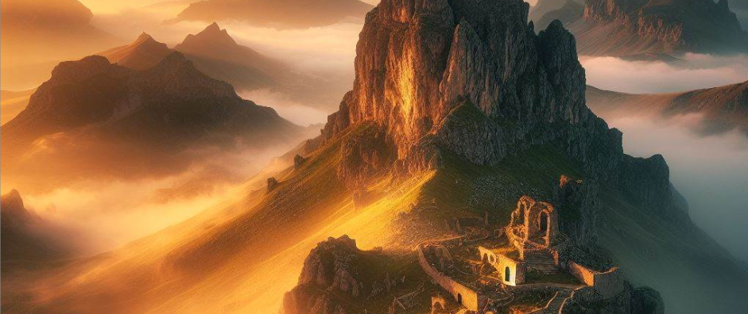

# StorytellerAI


Ever had an idea for a D&D campaign, but never got the campaign started because it is overwhelming and takes time to fully create all the lore for your world, backstories for NPCs, and good twists in your story?

Our team is creating a way to help the Dungeon Master (DM) receive aid from a tailored AI to support your in all these time consuming pre-tasks so that you and your friends can start the game sooner. The AI offers varying degrees of help: 

1. You write most of the story but AI will guide you the right direction
2. You write part of the story, and Storyteller can help write the rest
4. You provide simply the genre and a quick sentence, and it will plan out the lore, NPC backstories, and more set up for you!

## Getting Started

Run this code: ```npm install```  in the project directory

Install [Docker Desktop](https://docs.docker.com/get-docker/?_gl=1*628vpd*_ga*MTAzOTM5OTQ4Ni4xNzA5OTIwNTY5*_ga_XJWPQMJYHQ*MTcxMjkzOTY4Ny4xMy4xLjE3MTI5Mzk3MTEuMzYuMC4w)

Once Docker Desktop is fully installed, keep it open. You will need to have Docker Desktop open whenever you want to use docker, even in the command terminal.

Run ```docker-compose up --build```

The browser should update whenever you make changes.

### Troubleshoot:

- If it doesn't work, you may need to build a volume

  To make a volume, run: ```docker volume create storytelleraivolume```

  Try running again with ```docker-compose up --build```

- If you change the file structure, you may meed to close the terminal and run it again.

## Roadmap:

### Milestone 1:
Storyteller AI will provide lore, NPC backstories, monsters used and more based on how involved the user wants it to be with their campaign creation. This version will include user authentication, interaction with Storyteller AI, and receive a neatly formatted story, providing the user with all the information needed to start playing their campaign.

### Milestone 2: 
The user can save stories generated by Storyteller AI for later use. It will also generate images with DALE-E AI for certain scenes in your story.
	
	
## Current Technologies Used:

- Next.js
- Typescript
- Sass (.scss)
- Firebase
- Jest
- OpenAI
